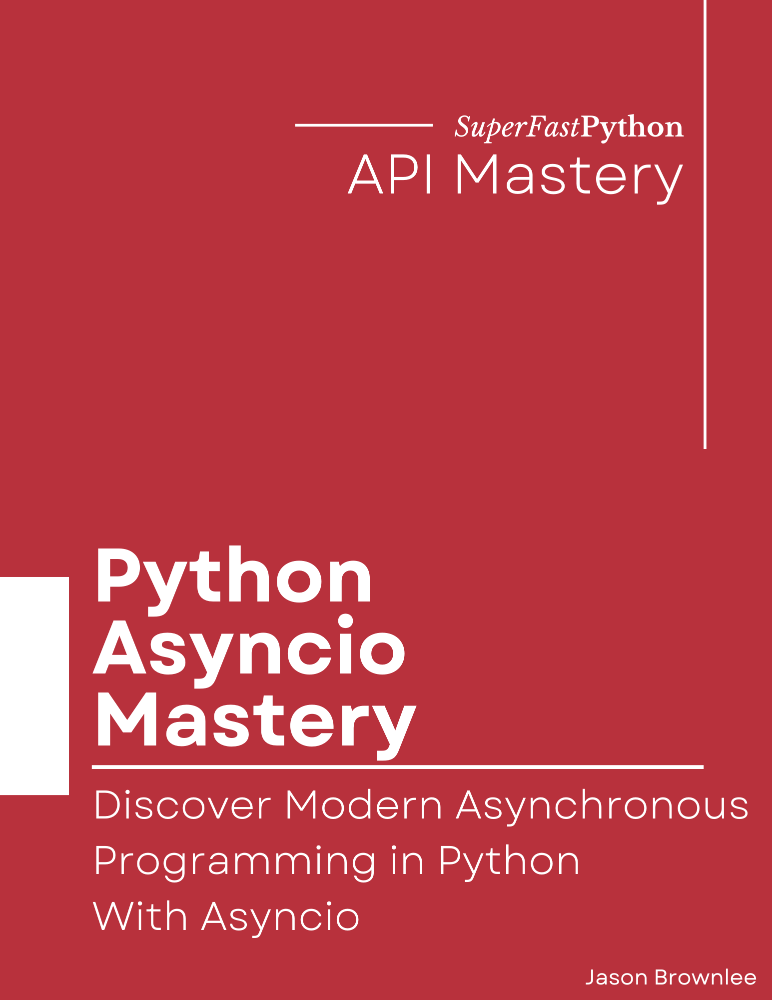

# Python Asyncio Mastery

* <https://github.com/SuperFastPython/PythonAsyncioMastery>

This repository provides all source code for the book:

* **Python Asyncio Mastery**: _Discover Modern Asynchronous Programming in Python With Asyncio_, Jason Brownlee, 2023.

## Source Code
You can access all Python .py files directly here:

* [src/](src/)

## Get the Book
You can learn more about the book here:

* Coming soon

### Book Blurb

> Asynchronous programming is built into Python.
>
> The language directly supports coroutines as first-class objects with the async and await expressions for asynchronous programming. The asyncio module provides tools for creating and managing asynchronous task and for developing non-blocking I/O client and server programs.
>
> Asyncio is not coming, it's here.
>
> Skills in asyncio are in demand and the demand is growing.
>
> Asynchronous programming and asyncio are how we develop modern scalable event-driven programs in Python. This paradigm dominates modern Python web development, API development, and network programming, and there are few Python programs that do not touch on these areas.
>
> Developing concurrent programs using coroutines and the asyncio module API can be very challenging, especially for Python developers that are new to asynchronous programming.
>
> Introducing: "Python Asyncio Mastery". A new book designed to teach you asyncio in Python, super fast!
>
> You will get fast-paced tutorials showing you how to develop asyncio programs on advanced topics, such as:
>
> Including:
>
> * How to define, schedule, and execute, check the status, and get results from asynchronous tasks.
> * How to manage groups of asynchronous tasks, including waiting for tasks, getting results, grouping tasks and using  timeouts.
> * How to use more advanced features of tasks such as shielding, sleeping, waiting for, and executing blocking tasks.
> * How to define, create, and use asynchronous iterators, generators, context manages, and queues.
> * How to safely synchronize and coordinate the behavior of coroutines with mutex locks, semaphores, barriers, and more.
> * How to run commands and perform non-blocking inter-process communication with subprocesses.
> * How to develop clients and servers with socket programming and perform non-blocking reads and writes.
>
> Each tutorial is carefully designed to teach one critical aspect of how to use asyncio in your Python programs.
>
> Learn Python asyncio correctly, step-by-step.